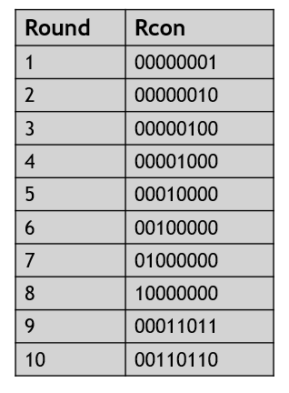

## FPGA_Design - Final Project
---
### 成員名單
E24056645、 E24053061、 E24056849
### Block Diagram

### 系統架構圖
##### Encryption:

##### Decryption:

### 設計說明
使用者輸入128bits的plaintext，以及128bits的key，經過加密後形成128bits的ciphertext。同樣地，使用者輸入128bits的ciphertext，以及128bits的key，經過解密可還原成原本128bits的plaintext。

下圖是加密的演算法流程，共有AddRoundKey、SubBytes、ShiftRows、MixColumns四種運算，一開始進行一次AddRoundKey後，依照SubBytes->ShiftRows->MixColumns->AddRoundKey的順序進行10個回合，除了第10個回合沒有MixColumns。
另外一開始使用的是使用者輸入的key，接下來的10個回合分別有10個round key。

#### AddRoundKey
將輸入的128bits分為B0至B15共16個bytes，key也分為K0至K15共16個byte，並將兩者做XOR:

#### SubBytes
每一個Byte依照Rijndael s-box進行轉換:

#### ShiftRows
第一列向左移1個Byte，第二列2個Bytes，第三列3個Bytes:

#### MixColumns
每一欄進行矩陣運算，乘上一個常數矩陣:

需要注意的是，MixColumn的加法使用的是XOR，而乘法進位時與一般乘法不同，如下:

#### Round Key Generation
有兩個步驟:(1)產生係數G(RotWord、SubBytes、XOR Rcon)(2)利用G生成新的Round Key。

###### (1)產生係數G
複製Wi-1，向上Rotate 1個Byte，得到的這四個Byte依照Rijndael s-box進行轉換，接著與當前回合的Rcon做XOR可得4個Bytes的係數G:

###### (2)產生新的Round Key

### Pynq-z2使用狀況
4183個LUT(7.86%)、60個LUT用於Distributed RAM(0.34%)、2889個Flip-Flop(2.72%)、1個BUFG(3.13%)

Setup time slack = 0.133ns

Total on-chip power = 1.481W

### 執行結果
首先選擇加密的動作，以16進位的方式輸入128bits的plaintext以及128bits的key，得到128bits的ciphertext，再利用相同的key將ciphertext解密回來，得到原本的plaintext。

### 結論
1.Encryption、Decryption皆需要key，沒有key的話難以進行Decryption，因此難以破解

2.使用到的FPGA resources的比例不多(LUT: 7.86%)

3.FPGA適合做AES電路: 使用到的運算只有XOR、shift、查表(s-box)、以及if-else之邏輯，其中shift只會影響繞線，而其他的功能較為簡單，output訊號所依賴的input不多，不用太多的LUT和MUX即可做出來。
