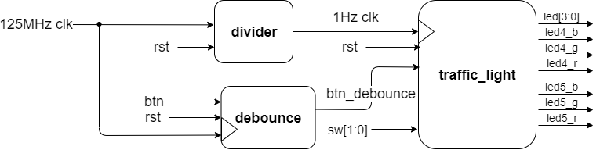

# FPGA_Design - Lab01 HW
---
### 成員名單
E24056645、 E24053061、 E24056849
### FSM State Diagram

### 紅綠燈時間配置圖

### 系統設計圖

### 設計概念說明
  狀態從S0到S5不斷循環，每個狀態都有對應的一組燈號，由時間配置圖可以看出在S0時，led4為綠燈，led5為紅燈，維持S0_time的時間，其餘皆以此判定。S0_time、S1_time、S2_time的初始值分別為5秒、1秒、1秒。

  Bonus的設計如下

* Switch 為 00 時 ，紅綠燈正常運作。

* Switch 為 01 時 ，按一次 BTN1 增加黃燈長 (S1_time) 1秒。

* Switch 為 10 時 ，按一次 BTN1 增加綠燈長 (S0_time) 1秒。

* Switch 為 11 時 ，按一次 BTN1 增加兩者重疊的紅燈長 (S2_time) 1秒。
* 4-bit LED 則顯示 led4 的燈號剩餘秒數。

由於按鈕按壓瞬間或放開瞬間的電壓訊號會不穩，因此加上了 debounce 電路，使得按鈕按壓一次只會發出一次訊號。
### 模擬波形
分別在sw = 00 及 01 時，按一次 BTN1

在sw = 10 及 11 時，按一次 BTN1

### Problems (10%)
1. 為什麼要加入 blinky.xdc 這個 Constraint ?

    合成的時候需要進行timing的計算來避免timing violation，所以需要利用.xdc檔輸入實際運作時的clock大小，而本次作業還有用到除頻器，在除頻器的輸出腳位也要標明它的clock大小。

2. 承上題，若沒有加入這個 Constraint，可能會發生什麼事?

    如果沒有加入這個Constraint的話，在合成時無法計算出各個路徑的delay以及slack的正負，當電路實際在FPGA運作時，可能會因為timing問題導致功能出錯。
