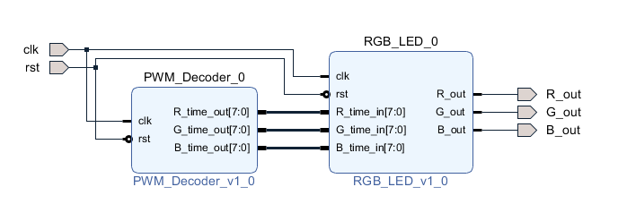
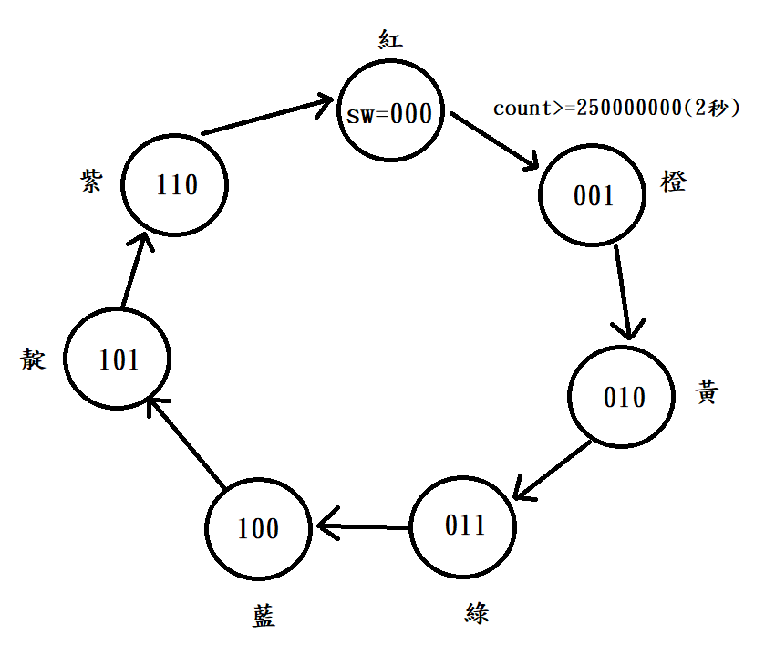
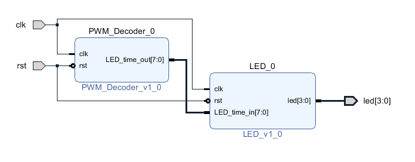
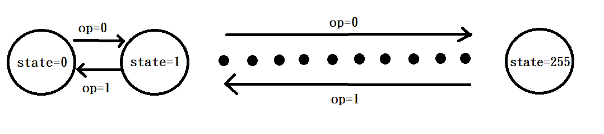
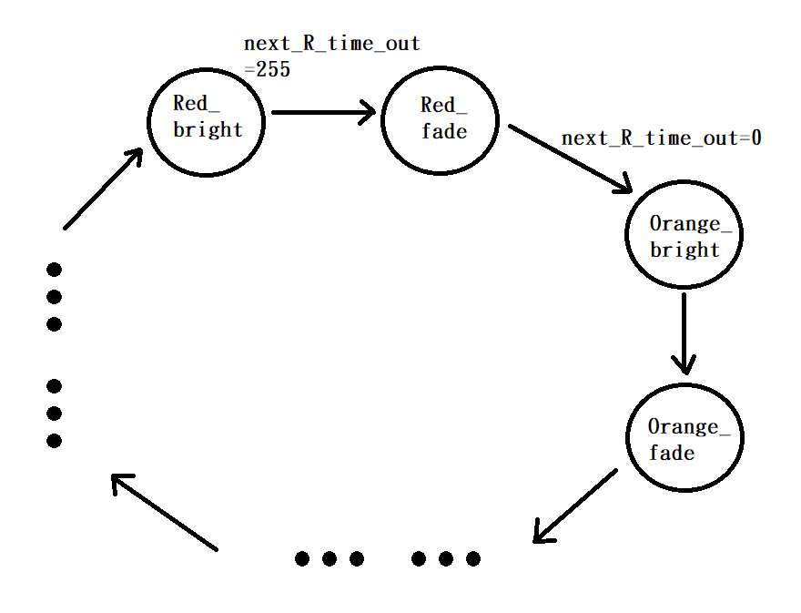

# FPGA_Design - Lab02 HW
---
### 成員名單
E24056645、 E24053061、 E24056849
### Program 1 - 使用 PWM 產生彩虹七色
##### 系統設計圖

##### 設計概念說明
RGB_LED藉由三個RGB輸入(0~255)，決定三種顏色輸出的脈波長度，也決定了我們看到的顏色。而PWM_Decoder就是決定RGB(0~255)的輸出，所以我們只要控制PWM_Decoder，就可以決定我們所看到的顏色，因此Program2、Bonus也都只要控制PWM_Decoder就好。

我們設計RGB LED燈每2秒換一種顏色，並採用FSM。sw狀態從000到110循環，每經過2秒換一個state，每個state都決定一種顏色，對應不同的RGB輸出，FSM和RGB的數值皆附在下方。

FSM State Diagram

| 顏色 | sw  | R   | G   | B   |
| ---- | --- | --- | --- | --- |
|  紅  | 000 | 255 |  0  |  0  |
|  橙  | 001 | 255 |  97 |  0  |
|  黃  | 010 | 255 | 255 |  0  |
|  綠  | 011 |  0  | 255 |  0  |
|  藍  | 100 |  0  |  0  | 255 |
|  靛  | 101 |  8  |  46 |  84 |
|  紫  | 110 | 160 |  32 | 240 |

### Program 2 - 使用單色 LED 實作呼吸燈
##### 系統設計圖

##### 設計概念說明
這題一樣先將PWM_Decoder及LED打包成2個IP，再將兩個IP用Block Diagram接起來。

PWM_Decoder中，state從0開始遞增到255再遞減到0，對應led[0]輸出從0(最暗)遞增到255(最亮)再遞減到0。我們設計從0遞增到255需時2秒，另外遞增或遞減由op這個訊號來控制，當state=255時op會變成1，state轉為遞減，當state=0時op變成0，state轉為遞增。

FSM State Diagram

### Bonus - 電競 RGB 呼吸燈
##### 系統設計圖

##### 設計概念說明
我們設計RGB LED最暗到最亮需時2秒，最亮到最暗也是2秒。由於RGB三個訊號的最大值(最亮)不一樣，這三個訊號在遞增或遞減時週期也會不同，需要獨立計數。另外我們透過14個state之間的循環，代表七種顏色和遞增遞減的狀態。當RGB其中某一個值到達最大值時，將會轉換成下一個state，例如state=Red_bright(紅色，漸亮)，我們取R作為標準，當R到達255的同時，state會變成Red_fade(紅色，漸暗)。

FSM State Diagram

| 顏色 | sw  | R   | G   | B   |
| ---- | --- | --- | --- | --- |
|  紅  | 000 | 255 |  0  |  0  |
|  橙  | 001 | 255 |  97 |  0  |
|  黃  | 010 | 255 | 255 |  0  |
|  綠  | 011 |  0  | 255 |  0  |
|  藍  | 100 |  0  |  0  | 255 |
|  靛  | 101 |  8  |  46 |  84 |
|  紫  | 110 | 160 |  32 | 240 |
