# FPGA_Design - Lab04 HW
---
### 成員名單
E24056645、 E24053061、 E24056849
### Block Diagram
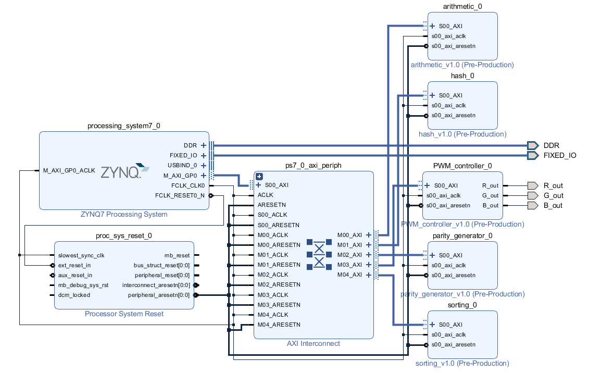

### Program 1 - sorting
數字位元為8bit，數列長度為8，採用的演算法為Insertion Sort。

##### 輸出結果
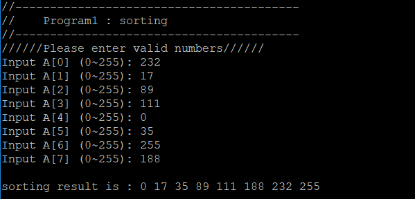

### Program 2 - arithmetic
數字位元為8bit，且運算結果以二補數來表示。加減法的結果為8bit，若超過則會overflow，乘法的結果為16bit，因此不會有overflow產生。

##### 輸出結果
輸入0為加法:

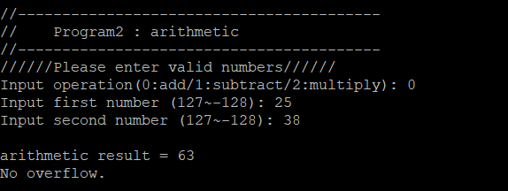
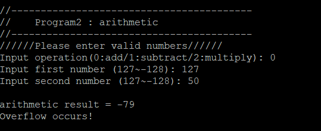

8bit的二補數只允許數字介於127~-128，上圖127 + 50 = 177因此有overflow產生。

輸入1為減法:

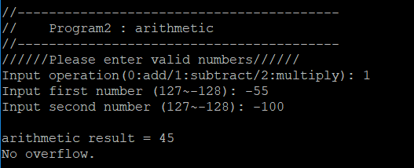
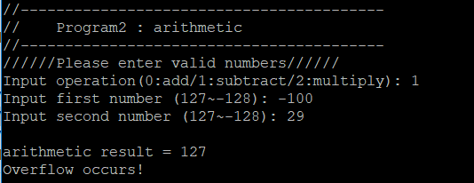

上圖-100 - 29 = -129，因此有overflow產生。

輸入2為乘法:

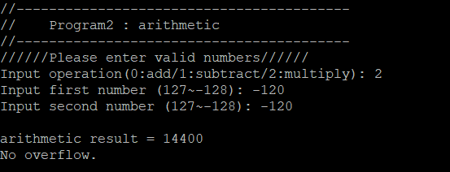

由於乘法允許輸出結果到16bit，數字可介於32767 ~ -32768，乘法最大(-128) x (-128) = 16384，因此乘法不會產生overflow。

### Program 3 - parity generator
數字位元為32bit，輸出even parity bit。

##### 輸出結果
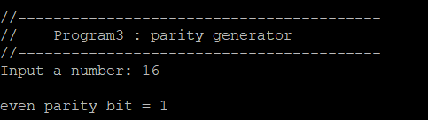

16以二進位表示為0...0010000，因此even parity bit = 1。

### Program 4 - hash
輸入一個最大長度為8的字串，每個字元依照其ASCII碼的數值傳入hash function，從第一個字元開始依序輸入，hash value為32bit。

##### 輸出結果
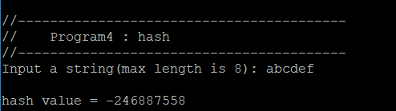

依序輸入a、b、c、d、e、f，ASCII碼分別為97、98、99、100、101、102。

hash = hash * 33 + character，hash起始為5381:

輸入a後hash = 177,670

輸入b後hash = 5,863,208

輸入c後hash = 193,485,963

輸入d後hash = 6,385,036,879(超過32bit，變成2,090,069,583)

輸入e後hash = 68,972,296,340(超過32bit，變成252,819,604)

輸入f後hash = 8,343,047,034(超過32bit，變成4,048,079,738)，轉為二補數即為-246,887,558

### Program 5 - PWM_controller
R、G、B皆為8bit，範圍為0~255。

##### 輸出結果
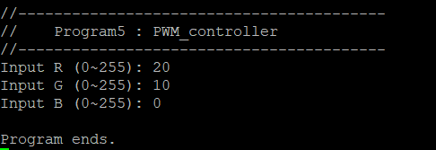
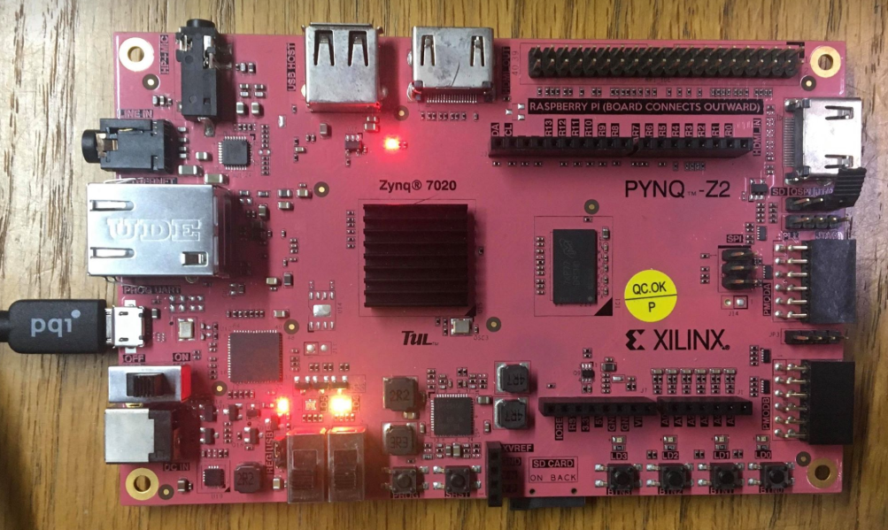

紅色(R = 20)加上較少的綠色(G = 10)，結果為橘色。
