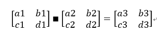
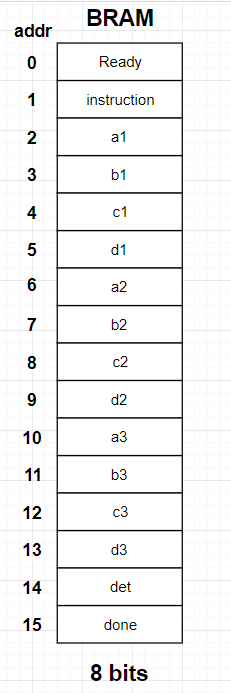
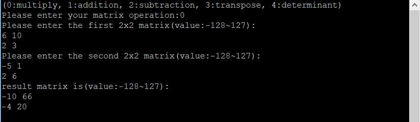
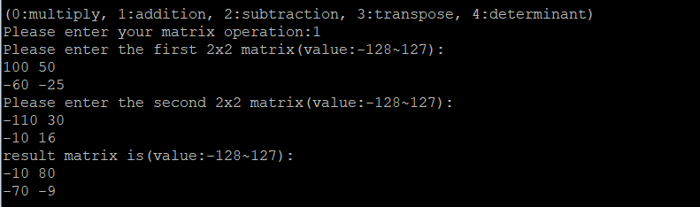
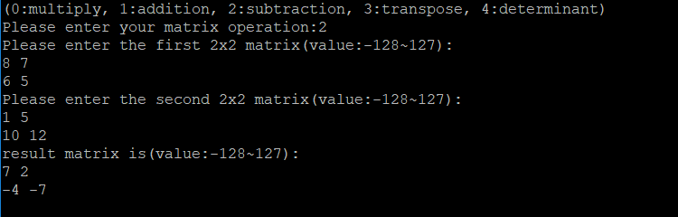
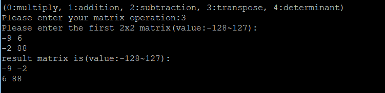

## FPGA_Design - Lab05 HW
---
### 成員名單
E24056645、 E24053061、 E24056849
### Block Diagram

### 系統架構圖

### 設計說明
  以2x2的矩陣進行乘法、加法、減法、轉置、行列式運算，矩陣數值皆以8 bits儲存，下圖表示變數對應的位置:

  當使用者輸入完指令以及矩陣的數值後，會將輸入資料以及Ready訊號寫入BRAM上，告知matrix processor可以開始運算了，運算完的矩陣數值寫入a3, b3, c3, d3或者將行列式值寫入det中，接著寫入done訊號在BRAM上，此時driver就會將結果讀出。以下為BRAM的配置圖:

### Program
由於每個數值皆以8 bits儲存，所以輸入範圍在-128至127之間，輸出的範圍也限制在-128至127。
#### 1.乘法

#### 2.加法

#### 3.減法

#### 4.轉置

#### 5.取行列式

