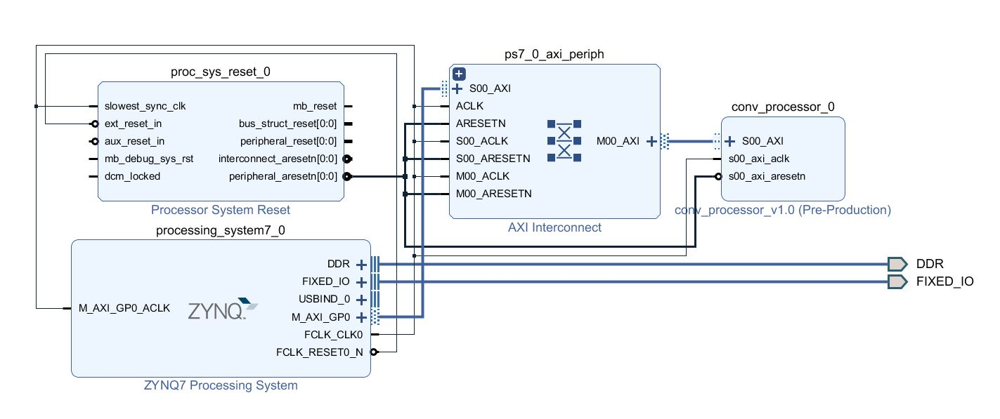
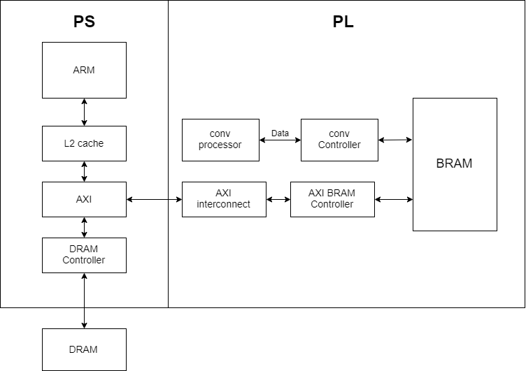
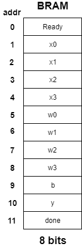
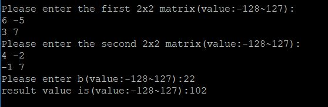
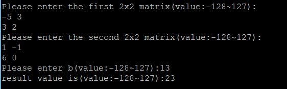

## FPGA_Design - Lab06 HW
---
### 成員名單
E24056645、 E24053061、 E24056849
### Block Diagram

### 系統架構圖

### 設計說明
  當使用者分別輸入完兩個矩陣還有一個相加的數後，會將輸入資料以及Ready訊號寫入BRAM上，告知conv processor可以開始運算了，運算完的數值寫入y中，接著還會寫入done訊號在BRAM上，此時driver就會將結果讀出。以下為BRAM的配置圖:

### Program
由於每個數值皆為8 bits且以整數方式儲存，所以輸入範圍在-128至127之間，輸出的範圍也限制在-128至127。
#### 輸出結果
1. 第一次測試

2. 第二次測試

